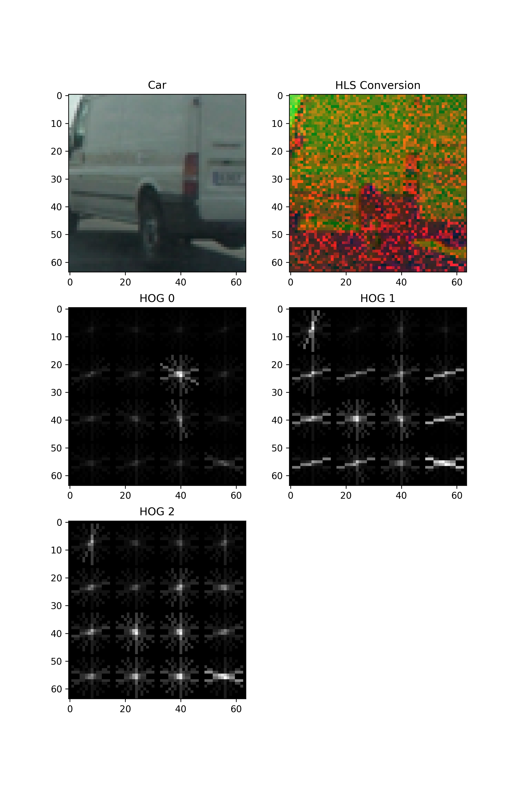

**Vehicle Detection Project**

[](http://www.udacity.com/drive)

###Summary###

In this project we are attempting to detect other vehicles within a driving video stream. The vehicles are Identified through a combination of feature extraction and linear classifiers. It is designed to cover the basics of those algorithms so it's performance is not optimized at this time.

####Video Results####

[](http://www.youtube.com/watch?v=fjs2ltGHCPw)

The above video shows both the lane detection algorithm from [Advanced Lane Detection](https://github.com/johncarpenter/CarND-Vehicle-Detection) project and the VehicleDetection program.


###Analysis and Discovery###

The goals / steps of this project are the following:

1. Perform a Histogram of Oriented Gradients (HOG) feature extraction on a labeled training set of images and train a classifier Linear SVM classifier
2. Optionally, you can also apply a color transform and append binned color features, as well as histograms of color, to your HOG feature vector.
3. Note: for those first two steps don't forget to normalize your features and randomize a selection for training and testing.
4. Implement a sliding-window technique and use your trained classifier to search for vehicles in images.
5. Run your pipeline on a video stream (start with the test_video.mp4 and later implement on full project_video.mp4) and create a heat map of recurring detections frame by frame to reject outliers and follow detected vehicles.
6. Estimate a bounding box for vehicles detected.

###Histogram of Oriented Gradients (HOG) Feature Extraction and SVM Classifier###

The first step in the project is to create a classifier model to be able to identify vehicles within an image. To do this we convert training images into a set of features and then created a classifier to identify whether an object is a "car" or "not a car". Using images provided ( [vehicle](https://s3.amazonaws.com/udacity-sdc/Vehicle_Tracking/vehicles.zip) and [non-vehicle](https://s3.amazonaws.com/udacity-sdc/Vehicle_Tracking/non-vehicles.zip) ) we created a feature set with HOG, spatial and color features appended together.

####Training images####
[]


```
Training...
Color Space HLS
Spatial Bin Size (16, 16)
Histogram Bins 16
Orientations 9
Px per Cell 16
Cell per Block 2
HOG Channel ALL
Use Spatial Features True
Use Histogram Features True
Use HOG Features True
Training with 8792 Car features
Training with 8968 Non-Car features
Using: 9 orientations 16 pixels per cell and 2 cells per block
Feature vector length: 1788
3.85 Seconds to train SVC...
Test Accuracy of SVC =  0.9907
Training finished
```


Creating a great writeup:
---
A great writeup should include the rubric points as well as your description of how you addressed each point.  You should include a detailed description of the code used in each step (with line-number references and code snippets where necessary), and links to other supporting documents or external references.  You should include images in your writeup to demonstrate how your code works with examples.  

All that said, please be concise!  We're not looking for you to write a book here, just a brief description of how you passed each rubric point, and references to the relevant code :).

You can submit your writeup in markdown or use another method and submit a pdf instead.

The Project
---

The goals / steps of this project are the following:

* Perform a Histogram of Oriented Gradients (HOG) feature extraction on a labeled training set of images and train a classifier Linear SVM classifier
* Optionally, you can also apply a color transform and append binned color features, as well as histograms of color, to your HOG feature vector.
* Note: for those first two steps don't forget to normalize your features and randomize a selection for training and testing.
* Implement a sliding-window technique and use your trained classifier to search for vehicles in images.
* Run your pipeline on a video stream (start with the test_video.mp4 and later implement on full project_video.mp4) and create a heat map of recurring detections frame by frame to reject outliers and follow detected vehicles.
* Estimate a bounding box for vehicles detected.

Here are links to the labeled data for [vehicle](https://s3.amazonaws.com/udacity-sdc/Vehicle_Tracking/vehicles.zip) and [non-vehicle](https://s3.amazonaws.com/udacity-sdc/Vehicle_Tracking/non-vehicles.zip) examples to train your classifier.  These example images come from a combination of the [GTI vehicle image database](http://www.gti.ssr.upm.es/data/Vehicle_database.html), the [KITTI vision benchmark suite](http://www.cvlibs.net/datasets/kitti/), and examples extracted from the project video itself.   You are welcome and encouraged to take advantage of the recently released [Udacity labeled dataset](https://github.com/udacity/self-driving-car/tree/master/annotations) to augment your training data.  

Some example images for testing your pipeline on single frames are located in the `test_images` folder.  To help the reviewer examine your work, please save examples of the output from each stage of your pipeline in the folder called `ouput_images`, and include them in your writeup for the project by describing what each image shows.    The video called `project_video.mp4` is the video your pipeline should work well on.  

**As an optional challenge** Once you have a working pipeline for vehicle detection, add in your lane-finding algorithm from the last project to do simultaneous lane-finding and vehicle detection!

**If you're feeling ambitious** (also totally optional though), don't stop there!  We encourage you to go out and take video of your own, and show us how you would implement this project on a new video!
