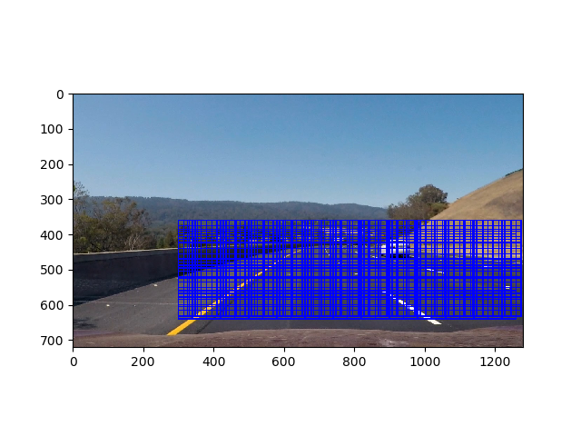
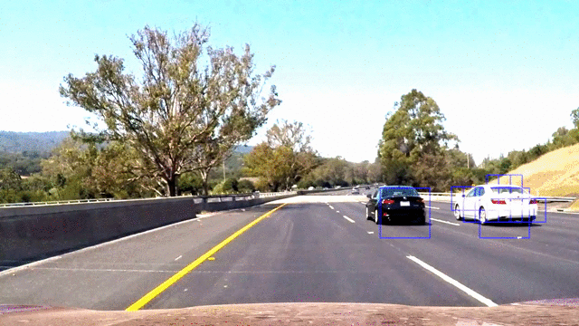

**Vehicle Detection Project**

[](http://www.udacity.com/drive)

###Summary###

In this project we are attempting to detect other vehicles within a driving video stream. The vehicles are Identified through a combination of feature extraction and linear classifiers. It is designed to cover the basics of those algorithms so it's performance is not optimized at this time.

####Video Results####

[](http://www.youtube.com/watch?v=fjs2ltGHCPw)

The above video shows both the lane detection algorithm from [Advanced Lane Detection](https://github.com/johncarpenter/CarND-Vehicle-Detection) project and the VehicleDetection program.

####Using the Program####
The videos are processed using ```video_processor.py``` file.

```
usage: video_processor.py [-h] -i INPUT -o OUTPUT [-c CAMERA] [-v VEHICLE]

Vehicle Detection and Lane Finding

optional arguments:
  -h, --help            show this help message and exit
  -i INPUT, --input INPUT
                        Input video file
  -o OUTPUT, --output OUTPUT
                        Output video file
  -c CAMERA             Calibration File from calibrate.py (Optional)
  -v VEHICLE            Vehicle Detection Pickle File
```


###Analysis and Discovery###

The goals / steps of this project are the following:

1. Perform a Histogram of Oriented Gradients (HOG) feature extraction on a labeled training set of images and train a classifier Linear SVM classifier
2. Apply a color transform and append binned color features, as well as histograms of color, to your HOG feature vector.
3. Normalize your features and randomize a selection for training and testing.
4. Implement a sliding-window technique and use your trained classifier to search for vehicles in images.
5. Run your pipeline on a video stream and create a heat map of recurring detections frame by frame to reject outliers and follow detected vehicles.
6. Estimate a bounding box for vehicles detected.

###Histogram of Oriented Gradients (HOG) Feature Extraction and SVM Classifier###

The first step in the project is to create a classifier model to be able to identify vehicles within an image. To do this we convert training images into a list of features. We then created a classifier to identify whether an object is a "car" or "not a car" using the feature sets. The training images provided ( [vehicle](https://s3.amazonaws.com/udacity-sdc/Vehicle_Tracking/vehicles.zip) and [non-vehicle](https://s3.amazonaws.com/udacity-sdc/Vehicle_Tracking/non-vehicles.zip) ) were provided as part of the course materials

####Training images####
Provided are two sample images from the training set, along with the HOG sampling.

[Car training image](output_images/training_car_sample.jpg)

[Not Car training image](output_images/training_non_car_sample.jpg)

####Configuration####

After a number of iterations we arrived at a feature set that was made up of *HOG features + Spatial Binning + Color Histogram* Below is the configuration from the ```training.log``` file that was used in the model generation
```
Color Space HLS
Spatial Bin Size (16, 16)
Histogram Bins 16
Orientations 9
Px per Cell 16
Cell per Block 2
HOG Channel ALL
Use Spatial Features True
Use Histogram Features True
Use HOG Features True
Feature vector length: 1788
```

In order to choose the parameters the ```train.py``` program was run a number of times. This program trained the model and tested it on a series of 6 images for testing. The output of the program gave both the training parameters in the ```training.log``` file and a visual representation of the vehicle identification. This gave two measures to verify the classifier would be suitable for our video

```
usage: train.py [-h] cars notcars

Vehicle Detection Training Program

positional arguments:
  cars        Cars image directory
  notcars     Not cars image directory

optional arguments:
  -h, --help  show this help message and exit
  ```
In training the classifier, we separated 20% of the data for testing purposes. This gave a small measure for the
accuracy for the ```LinearSVC``` classifier. Below is the output from the training using the configuration parameters from above;

```
training.log

Training...
Color Space HLS
Spatial Bin Size (16, 16)
Histogram Bins 16
Orientations 9
Px per Cell 16
Cell per Block 2
HOG Channel ALL
Use Spatial Features True
Use Histogram Features True
Use HOG Features True
Training with 8792 Car features
Training with 8968 Non-Car features
Using: 9 orientations 16 pixels per cell and 2 cells per block
Feature vector length: 1788
3.85 Seconds to train SVC...
Test Accuracy of SVC =  0.9907
Training finished
```
Once the model was validated it was saved to ```vehicle_detection.p``` pickle file along with the configuration.

###Searching the Image###

Once the classifier was completed, the next step was to search the image for potential matches from the classifier. This was accomplished by creating sliding a test window across the image. Different window scales were required to handle different sized vehicles in the image. And so we repeated the search with a variety of window sizes.


Shows the windows that were used within the image

The sliding windows proved to be the largest performance drain on the application so the processes to choosing the number of sliding windows was based on trying to minimize the search to as few windows as possible. The following steps were taken;

1. Minimize the search to just the area on the road. As seen in the image above
2. Maintain a historical record of the previous N iterations and use that to supplement the search in the current windows
3. Keep the number of different sizes to a minimum (2)

We eventually decided on two window sizes (52,52) and (110,110) each with a 50% overlap. This caused a number of false positives which we then used post-processing to remove them.

```python
hot_windows += self.__search(img,SearchConfig(x_start_stop=x_start_stop,y_start_stop=y_start_stop, xy_window=(52,52),xy_overlap=(0.5,0.5)))
  hot_windows += self.__search(img,SearchConfig(x_start_stop=x_start_stop,y_start_stop=y_start_stop, xy_window=(110,110),xy_overlap=(0.5,0.5)))

```

####Heatmap Thresholding####

As each sliding window registered a hit with the classifier, it was added into a list of successes. Those list of successes were overlaid onto a heatmap. Those pixel values that exceeded a threshold were considered a successful vehicle detection. Test images are shown below;


*Note:The images above show a high amount of false-positive results. The decision was made to handle these post-processing. Testing with the thresholds and window sizes showed we could remove the false-positives but that occasionally failed to track vehicles. It was more important to register false-positives than miss identify vehicles. Post-processing doesn't operate in single image mode*

####Post-Processing####

The biggest improvement in the detection came from aggregating information across multiple scenes. This allowed us to effectively remove most of the outliers and track the vehicles instead of vehicle detections. Only two simple systems were used.

1. Aggregate heatmaps across 12 frames. By storing the results from the heatmaps across 12 frames and increasing the threshold we are filtering out any false-positives that are short lived. Typically this was from shadows or colour changes on the road surface. The code for handling that averaging is shown below.

```python

    # Keep a running record for the last 500ms
    self.prev_hot_windows.append(hot_windows);
    if(len(self.prev_hot_windows) >= 12):
        self.prev_hot_windows.pop(0)

    # Append all the information from the last 12 frames into one estimator
    hot_windows = []
    for hw in self.prev_hot_windows:
        hot_windows += hw

    #Create heatmap style image from overlaid windows.
    thresh = int(len(self.prev_hot_windows)*0.75)  #Threshold is based upon size of historical data
    heatmap = filter_by_heatmap(img, hot_windows,thresh=thresh)

```

2. Move from tracking hits to tracking vehicles. We created a class ```CarBlob``` to act as a container for a potential car hits and tracked that between epochs. From this we could also minimize the variance in the window sizes by apply a simple dampening filter over each update. The effect was a smoother window track but likely this class will be important part of improving the performance.

You can see the effect of the processing in this image. Blue boxes are the original hits, and green boxes are where the post-processing is performed



###Discussions####

The project was successfully able to track the vehicles within the provided video and test images using the algorithms mentioned above. There were a couple of false-positives, the video

####Potential Issues####

1. Training of the classifier used a subset (for the purposes of the course, likely optimized) of training data provided to work with the video. This could have created an overly optimistic classifier which was tuned to work with the project video

2. Small video set. The project was tuned to work with the project video and the configurations were based upon the values that worked for this video set.

3. Does not operate in real-time. See performance below

####Performance#####

The vehicle detection algorithm still lags behind being able to operate in real-time. Based on 2.7 GHz Intel Core i5 8GB Macbook, the algorithm could only maintain a 1.04 seconds / frame (s/it) processing time. About 20 times slower than required. A couple of solutions may be able to solve this;

1. Reduce the sampling rate. This had a direct improvement on the processing speed although it was not able to register vehicle changes very quickly. Even a change of every 2nd/3rd frame showed a linear improvement in speed. Adding vehicle dynamics and predictions would improve this.

2. Adaptive window searches. Since we are tracking the vehicles we can focus search in their predicted locations, and minimize the global searches.

3. There was some effort to remove background information with ```cv2.createBackgroundSubtractorMOG2```. I suspect if we can remove those parts of the image that are not changing rapidly overtime we can identify moving vehicles. Of course this wouldn't work for stopped or parked vehicles but it may be part of a larger search routine
